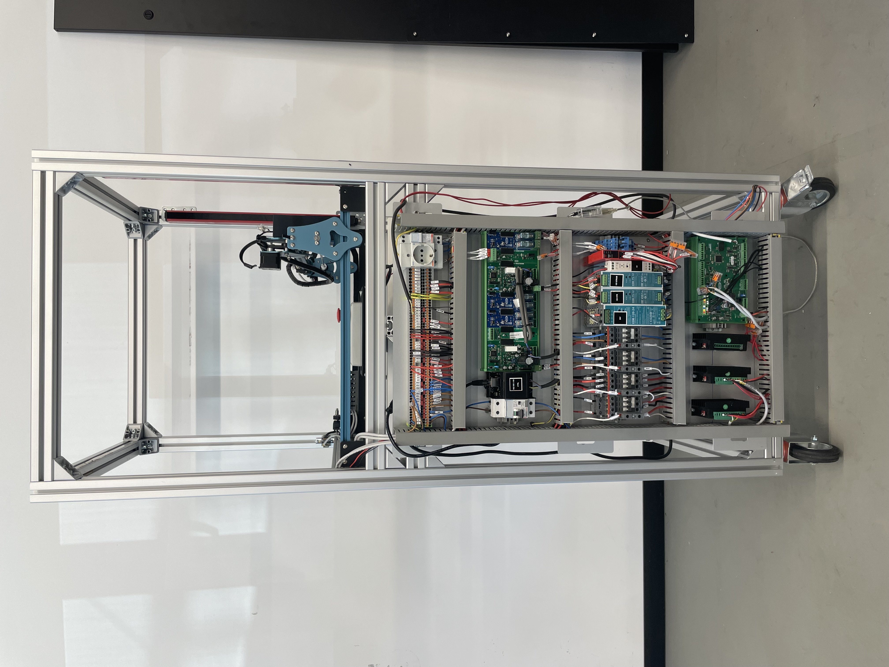
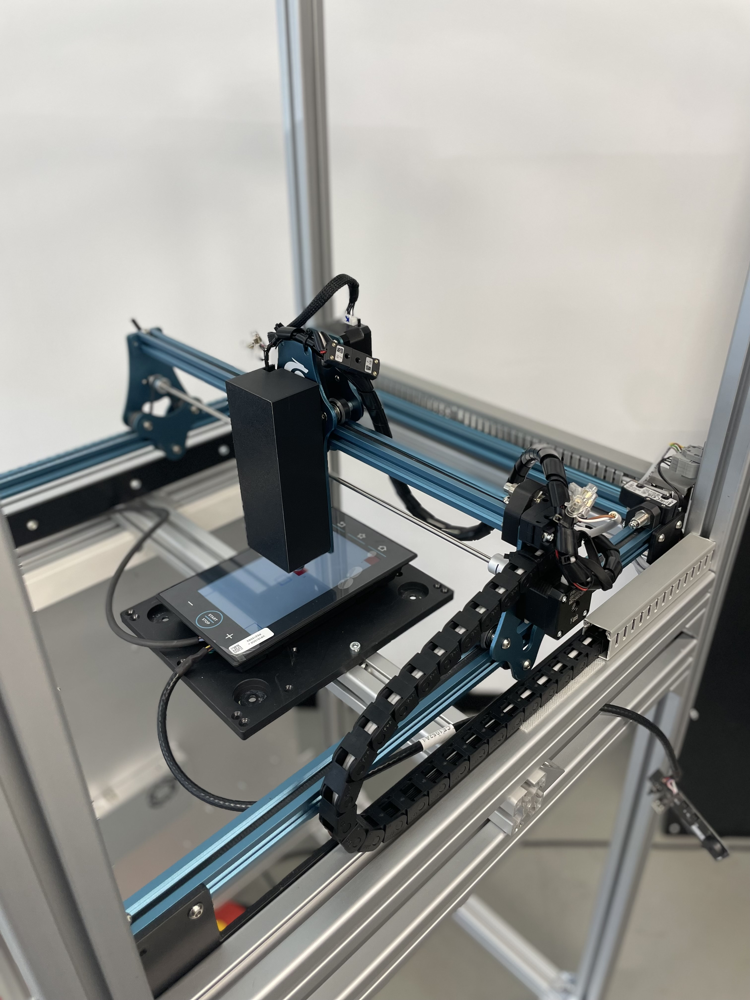
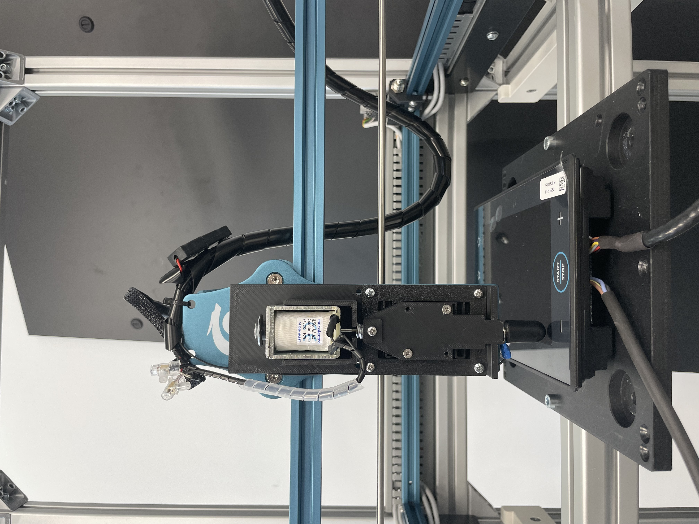

# Screen Tester Machine  

## Overview

This is an interdisciplinary mechatronics project developed during an internship in the validation department of an Italian electronics company, in collaboration with the University of Padua. It automates the testing of capacitive touch displays by integrating mechanical, electronic, and embedded software components into a unified system.

The platform features multi-axis motion control using stepper motors and custom firmware running on an LPC1768 microcontroller.  
The firmware, written in embedded C, manages both the working routine and low-level stepper motor control.

The design covers all major functional areas of a mechatronic system:

- **Hardware**: Starting from a modified commercial multi-axis platform, the entire structure was redesigned using 3D models and assembled manually. Two commercial machines were evaluated—a 3D printer and a laser cutting machine. The latter was selected for the final build.
- **Electronics**: Custom drive electronics were developed to ensure reliability and flexibility, replacing the original laser machine’s control board. Two stepper drivers were interfaced with the LPC1768 controller.
- **Software**: Both machine routine logic and stepper motor control functions were developed. Special focus was placed on motor speed control. The final version supports a trapezoidal speed profile, with other options also available.

Ultimately, the core focus of the project is system integration: all components were developed independently, with continuous consideration of their role within the complete system. This is arguably the most critical and complex aspect of any mechatronic design.

## The Machine

The machine automates the validation process of capacitive touch displays after production. Each display normally requires manual testing—touching a series of points to verify functionality. This machine performs the validation process automatically.  
Future versions aim to further optimize validation by incorporating additional phases such as display programming and automatic color validation.

## Subsystems

### Mechanical

The `mechanical` folder contains descriptions of the system assemblies. Both 3D-printed and machined parts were used. The commercial laser cutter was modified and integrated into an aluminum extrusion frame. All components were designed in 3D prior to assembly.

A key innovation was the development of a compliant mechanism for the touch interface. The touch tip had to press against the display and then release—this was achieved using a solenoid acting on a 3D-printed compliant structure. This solution provided the required flexibility and tight tolerances in a single part.  
The previous traditional system relied on a spring and an aluminum guide, which were more expensive to manufacture and less precise.

### Electrical

This subsystem handles actuation signaling, sensing, and power distribution:
- Dual TB6600 stepper driver control  
- Solenoid actuation with flyback protection  
- Software-selectable endstop inputs via multiplexer  
- Multiple power domains (24V, 12V, 5V) managed by the LPC1768 controller  

### Software / Firmware

The embedded software is written in **C** and runs on a custom LPC1768 (ARM Cortex-M3) controller. It provides real-time orchestration of motion, touch actuation, sensing, and test sequencing for touchscreen validation. See the dedicated section for more detail.

#### Outcomes
- Designed for extensibility: new test patterns, conditional logic, and additional sensors can be integrated without altering the core logic  
- Demonstrates real-time embedded programming, state-machine design, and system-level integration under resource constraints
