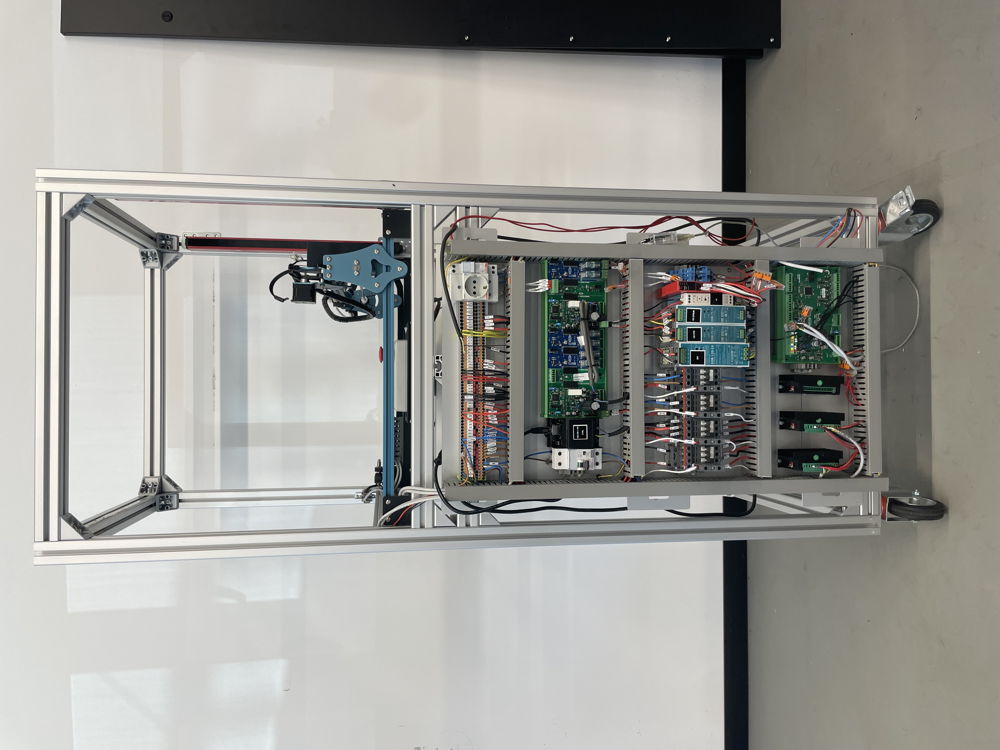

# Electrical Subsystem — Screen Tester Machine  

## 1. Introduction

This document describes the electrical subsystem, its architecture, and its role within the broader system. The focus is on functional description, component interaction, and design rationale.

## 2. System Overview

The electrical subsystem interfaces the mechanical actuation, sensing, and control logic. Its primary responsibilities are:

- Driving two stepper motors to position the stylus/probe via TB6600 drivers  
- Actuating a solenoid for discrete tap interactions  
- Sensing positional limits through endstops with selectable inputs  
- Distributing and conditioning multiple power domains  
- Centralized coordination through a custom LPC1768-based controller  

Control logic, signal multiplexing, and sequencing are consolidated on the custom LPC1768 board. The board issues actuation commands, selects among endstop inputs in software, and orchestrates the timing of movements and interactions.

## 3. Embedded Visual Reference

*Figure 1* shows the physical arrangement of key electrical components and provides contextual insight into signal flow, power routing, and subsystem placement.

## 4. Component Description

### 4.1 Microcontroller and Control Logic

The core intelligence resides on a custom board based on the **LPC1768** microcontroller. This board:

- Generates digital control signals for the stepper drivers (pulse, direction, enable)  
- Drives the solenoid actuator directly via a digital output  
- Samples endstop states through a software-controlled multiplexer  
- Manages synchronization and sequencing for test routines  

Software selection of multiplexer channels allows flexible polling of multiple endstop sensors using minimal input pins.

### 4.2 Stepper Motor Interface

Two stepper motors are interfaced via **TB6600** drivers. Each driver receives:

- **PUL (Pulse):** Step increment signal  
- **DIR (Direction):** Movement direction  
- **ENA (Enable):** Gate to enable/disable outputs  

These signals originate from the LPC1768 digital outputs and are logic-compatible with the TB6600 modules, assuming a shared 5V reference. Signal integrity is maintained by appropriate routing and respecting timing requirements inherent to the driver.

### 4.3 Solenoid Actuation

The solenoid provides discrete tactile interactions (e.g., taps). It is driven directly from a digital output on the LPC1768 board. A **flyback diode** is placed in parallel with the coil to suppress inductive voltage spikes when the drive is released, protecting the driving circuitry.

### 4.4 Endstop Sensing

Endstop sensors are multiplexed: a software-controlled **multiplexer** selects which endstop is routed back to the LPC1768 for sampling. This reduces pin usage while retaining the ability to monitor multiple limit switches. Defined idle logic levels are ensured via pull-ups/pull-downs, and debounce logic in firmware stabilizes mechanical chatter.

## 5. Power Architecture

The electrical subsystem employs distinct voltage domains to meet component requirements:

- **24V Domain:** Powers the LPC1768-based control board and the touchscreen under test.  
- **12V Domain:** Supplies the solenoid actuator.  
- **5V Domain:** Supplies logic levels for the TB6600 driver inputs and any ancillary digital circuits.  

