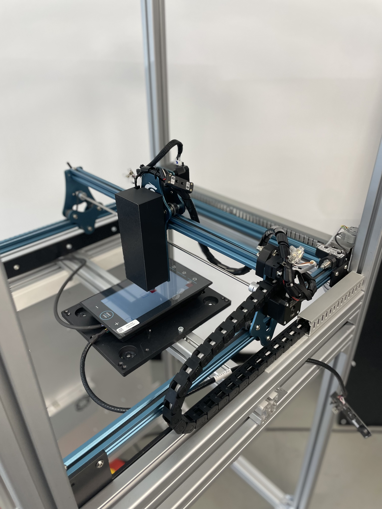
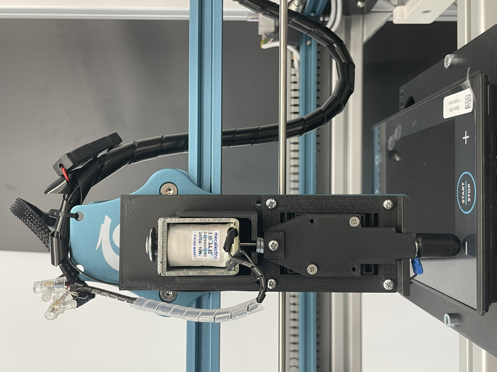
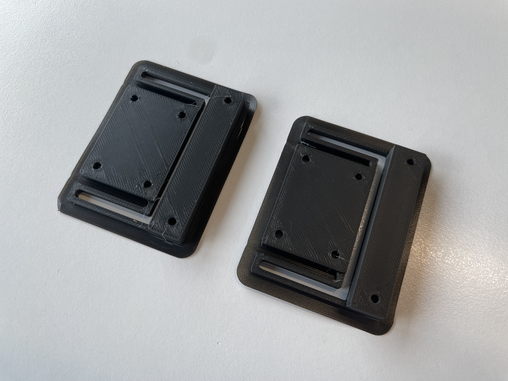
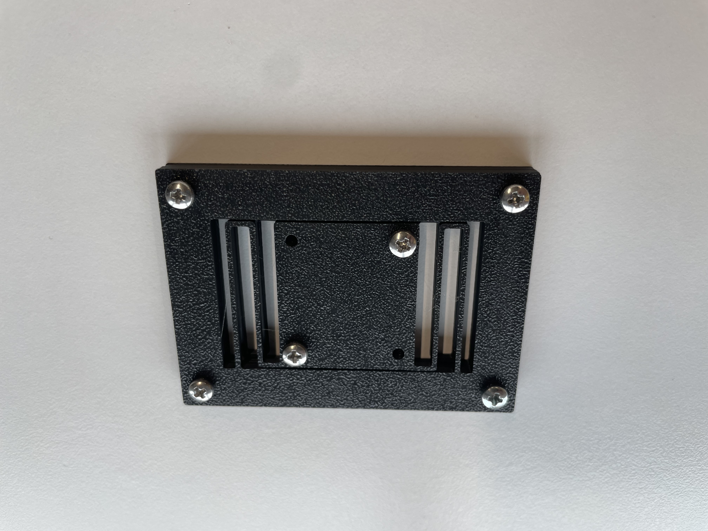

# Mechanical Subsystem — Screen Tester Machine  

## 1. Introduction

The mechanical subsystem implements the physical interaction layer of the Screen Tester Machine. It comprises the complete structural assembly, interchangeable touch heads in two development stages (conceptual and realized), and a compliant mechanism implemented in two variants to mediate force or alignment. This document describes the design, evolution, and rationale behind each major mechanical element, emphasizing system integration, modularity, and functional trade-offs.

## 2. Overall Assembly

*Figure 1* presents the full assembly. The design integrates actuation (from the electrical subsystem), sensing, and the user-contact interface (touch head) into a coherent structure. Key sub-assemblies include the motion positioning stage, the mount for the touch head, compliant interface elements, and the structural frame that ensures repeatability and rigidity under load.

### 2.1 Objectives of the Mechanical Design

- Provide precise and repeatable positioning of the touch interface relative to the display under test.  
- Enable modular swapping and iteration of touch head designs without full system redesign.  
- Isolate and control interaction forces through compliant elements to mimic realistic touches while protecting the device under test.  
- Maintain manufacturability and rapid prototyping capability (e.g., via 3D printing) for iterative development.

## 3. Touch Head Design

The touch head is the contact interface that physically interacts with the capacitive display. Two versions were developed: a conceptual (drawn) version and a realized version using 3D printed components.

### 3.1 Version 1: Conceptual / Drawn Design

Version 1 exists as a detailed design drawing / CAD sketch. It defines:

- Geometry intended to emulate a fingertip or stylus contact patch  
- Mounting interface compatible with the positioning mechanism  
- Intended degrees of freedom and kinematic assumptions  
- Placeholder for compliance or cushioning (if any) in the conceptual stage  

This version served to validate form, fit, and the integration strategy before committing to fabrication.

### 3.2 Version 2: Realized 3D-Printed Touch Head

Version 2 is the physically fabricated iteration based on the initial concept. Key characteristics:

- **Material:** PLA
- **Post-processing:** (e.g., smoothing, fitting, inserts)  

This realized head was used in empirical testing to assess contact consistency, durability, and repeatability.

## 4. Compliant Mechanism

A compliant mechanism is used to modulate interaction force and absorb minor misalignments between the rigid motion system and the touch surface. Two versions of this mechanism were developed to explore different trade-offs in stiffness, travel, and complexity.

### 4.1 Version 1: Initial Compliant Design

Version 1 utilizes a basic flexure-based geometry designed to allow controlled axial compliance while maintaining lateral constraint. It proved to be too stiff for the scope.

### 4.2 Version 2: Refined Compliant Mechanism

Version 2 represents an evolved design, incorporating lessons from version 1:

- Decreased stiffness
- Integration of mounting features to reduce assembly complexity  

This iteration aimed to balance precision of actuation with robustness over repeated test cycles.

## 5. Mechanical Integration and Interfaces

The touch head and compliant mechanism are mounted to the primary motion stage. The interface between these subsystems was designed for:

- **Quick interchangeability:** Mechanical interfaces (e.g., dovetail, screw boss, snap-fit) allow swapping in the field.  
- **Alignment tolerance:** Compliant elements compensate for small misalignments without degrading measurement fidelity.  

## 6. Design Considerations

- **Prototyping speed:** 3D printing enabled rapid iteration from version 1 to 2 for both touch heads and compliant elements.  
- **Repeatability vs. compliance:** Trade-offs were explicitly evaluated; too much compliance reduces positional accuracy, too little risks damaging the display.  
- **Modularity:** Subsystems are decoupled to allow independent redesign (e.g., new touch head geometries) without retooling the entire assembly.  
- **Manufacturability:** Feature sizes, overhangs, and assembly clearances were constrained by typical FDM printer capabilities.

## 7. Validation Strategy (Descriptive)

Validation of the mechanical subsystem encompassed:

- **Geometric verification:** Ensuring fabricated parts adhered to design dimensions within expected tolerances.  
- **Force profiling:** Measuring the actual contact forces delivered through the compliant mechanism and comparing to target touch profiles.  
- **Durability testing:** Cycling the touch head/compliant interface to observe wear or degradation.  
- **Alignment robustness:** Introducing deliberate offset and measuring if the compliant mechanism compensated without system failure.  
- **Interchangeability checks:** Swapping touch heads and confirming consistent mounting and functional behavior.

## 9. Future Work / Extensions

- Design of alternative touch head geometries (e.g., soft-touch, multi-point)  
- Multi-material compliant mechanisms to introduce tunable damping  
- Embedding sensors (force/pressure) within the compliant interface for closed-loop feedback  

## 10. Conclusion

The mechanical subsystem provides a flexible, modular, and experimentally grounded physical interface for the Screen Tester Machine. Through iterative development of touch heads and compliant mechanisms, the design balances precise actuation, repeatable contact, and protection of the device under test, fulfilling the core goals of the university project.
